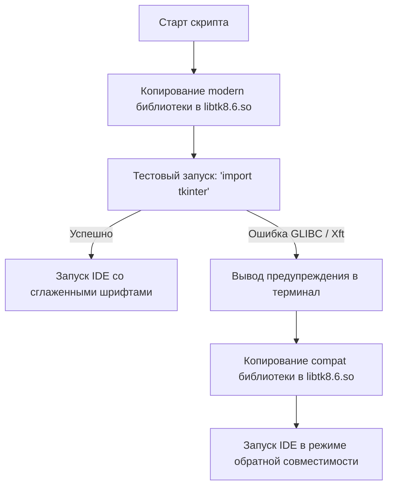

# Техническая спецификация МШПайтон.Оффлайн

Архитектура системы, внутренние механики, конфигурация переносимого интерпретатора и платформенно-зависимые скрипты запуска.

---

## 🏗️ Архитектура проекта

Проект разделен на три независимых пакета под основные операционные системы:
```
МШПайтон.Оффлайн/
  ├── MSHP-IDE-Windows/    # Сборка под Windows (x86_64)
  ├── MSHP-IDE-macOS/      # Сборка под macOS (Intel + Apple Silicon)
  └── MSHP-IDE-Linux/      # Сборка под Linux (x86_64 + AArch64)
```

Внутри каждой папки развернута одинаковая базовая структура:
* `app/ide.py` — основной исходный код графического интерфейса IDE (на базе библиотеки Tkinter).
* `python/` — изолированный переносимый (portable) дистрибутив Python.
* `.runtime/` — временная папка для автосохранения несохранённых вкладок и выполнения процессов.

---

## 🚀 Механизм запуска и поиска Python

Поиск интерпретатора при запуске через командные файлы (`.sh` / `.bat`) выполняется по следующему алгоритму:
1. Проверяется переменная окружения `PYTHON_PORTABLE`. Если она задана и путь существует, используется этот интерпретатор.
2. Выполняется локальный поиск внутри папки `python/`:
   * **Windows:** Поиск файла `python.exe` во вложенных каталогах.
   * **macOS / Linux:** Скрипт определяет архитектуру процессора (`uname -m`) и выбирает соответствующий каталог (`python/x86_64` или `python/aarch64`), после чего ищет бинарный файл `python3` или `python` внутри папки `bin/`.

---

## ⚡ Особенности работы Linux-версии (Динамический fallback)

По умолчанию дистрибутив поставляется со сглаженными векторными шрифтами (Xft), для чего в папке `python/x86_64/lib/` размещена кастомная библиотека `libtk8.6.so.modern` (требует GLIBC 2.38+). 

Однако бинарный файл `python3` собран с параметром `DT_RPATH`, ссылающимся на `$ORIGIN/../lib`, что заставляет линкер искать библиотеки там в обход `LD_LIBRARY_PATH`. Для обеспечения стопроцентной совместимости на старых системах и WSL в скрипте запуска реализован механизм копирования:



Благодаря физической подмене файлов при тесте линкер всегда загружает нужную библиотеку, гарантируя запуск даже на «голых» серверах и консольных дистрибутивах.

---

## 🍎 Особенности работы macOS-версии (Обход Gatekeeper)

При скачивании переносимых программ из сети macOS автоматически применяет к ним карантинный атрибут безопасности, блокирующий запуск бинарных файлов и загрузку неподписанных dylib-библиотек (ошибки `Killed: 9` или блокировки запуска).

В macOS-скрипте запуска реализованы две защитные механики:
1. **Автоматический сброс карантина:** При каждом запуске скрипт рекурсивно очищает карантинный атрибут со всей папки дистрибутива с помощью утилиты `xattr`:
   ```bash
   xattr -d -r com.apple.quarantine "$ROOT" 2>/dev/null || true
   ```
2. **Принудительное восстановление прав:** Перед вызовом интерпретатора скрипт выдает права на исполнение всем бинарным файлам в папке `bin/`:
   ```bash
   chmod +x "$PYDIR"/bin/* 2>/dev/null || true
   ```

---

## 🐢 Внутренняя реализация Turtle-режима

Если в коде пользователя обнаруживается инструкция `import turtle`, выполнение перенаправляется **внутри процесса самой IDE** (без создания дочернего процесса `subprocess.Popen`):
1. **Встраивание Canvas:** В правой части графического интерфейса активируется виджет `tk.Canvas`, в котором разворачивается область рисования `turtle.TurtleScreen`.
2. **Переопределение блокирующих методов:** Методы `turtle.done()`, `turtle.exitonclick()` и `turtle.mainloop()` переопределяются в пустые функции (no-op), чтобы избежать зависания и блокировки главного цикла событий Tkinter.
3. **Маршрутизация ввода:** Стандартная функция ввода `builtins.input` подменяется на чтение из графической очереди `input_queue` самой среды разработки, позволяя использовать единое текстовое поле ввода.

---

## 🛠️ Минимизация размера дистрибутива

Для снижения веса дистрибутива из состава стандартного Python удалены все избыточные компоненты, не влияющие на стабильность запуска и работу стандартной библиотеки:
* Папки `ensurepip`, `idlelib`, `turtledemo`, `pydoc_data`.
* Файлы тестов стандартных библиотек (`test`, `tests`).
* Локальные кэши интерпретатора (`__pycache__`).
* Избыточные исполняемые файлы и исходные хедеры (`include`, `libs`).
